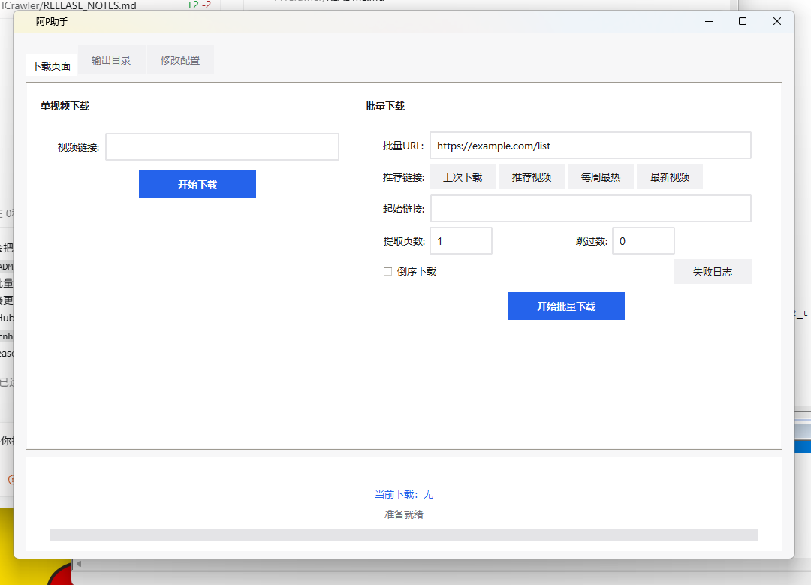
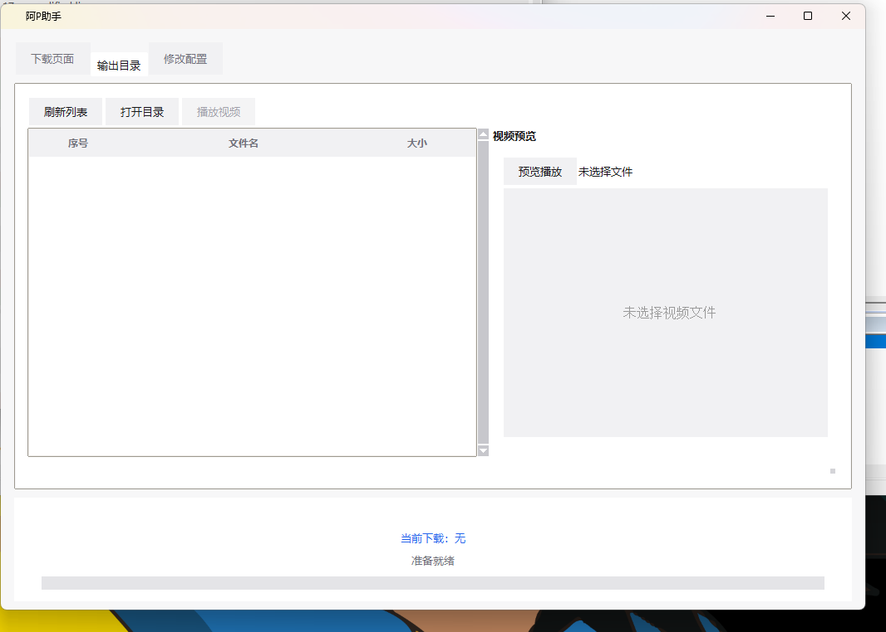
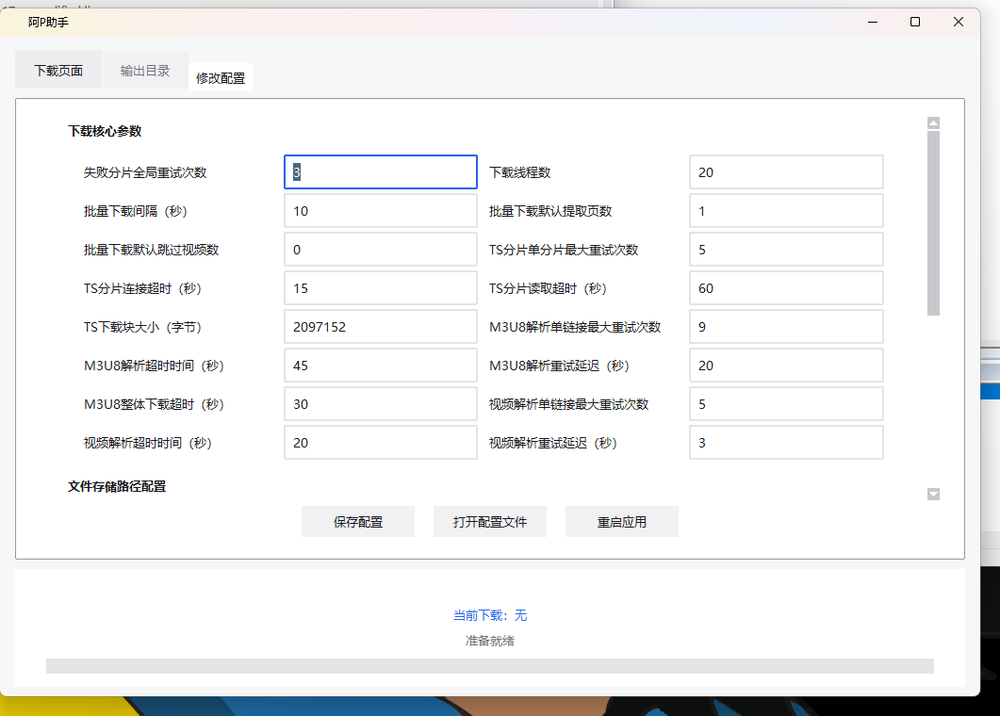
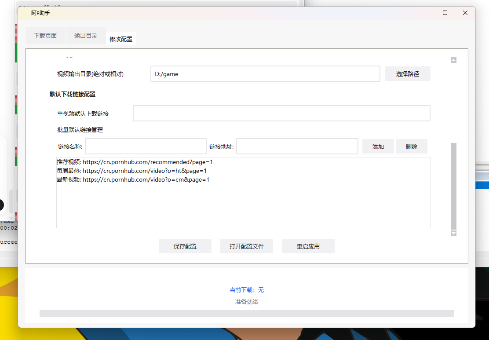

# PornhubCrawler

[中文](README.md) | [English](README_EN.md)

PornhubCrawler is a Windows desktop downloader built specifically for Pornhub. It supports single-video downloads, batch processing, consecutive multi-page downloads, concurrent downloads, retries, and task management.

> This project is implemented specifically for Pornhub pages and video resources. It does not support other video websites and is not a general-purpose website downloader.

> **Usage restriction: this project is provided solely for personal learning, technical research, and educational exchange. Any commercial use—including sale, paid distribution, commercial services, or monetization—is prohibited.**

## Download

[Download the latest PornhubCrawler for Windows x64](https://github.com/Qiuyue0125/PornhubCrawler/releases/latest/download/PHCrawler-Windows-x64.zip)

Extract the ZIP completely, then run `ph_crawler.exe`. The application depends on the bundled browser, driver, and FFmpeg files, so do not copy or run the executable by itself.

## Interface

### Download page

The application supports both single-video and batch downloads. To download multiple consecutive listing pages, enter the required number in **Pages to extract**. The **Skip count** field can skip a specified number of videos at the beginning of the list.



### Output directory

View downloaded files and their sizes, preview videos, and open the output directory.



### Download parameters

Configure worker count, batch interval, segment retries, connection/read timeouts, and M3U8 parsing retries.



### Paths and shortcut links

Configure the output directory and default single-video URL, and add or remove batch-download shortcut links.



## Default UI mode

Release builds use the full normal interface by default:

```json
"_UI_MODE": 1
```

Mode `1` displays the complete file and task management interface. Setting it to `0` switches to the simplified interface.

## Features

- Parse and download individual Pornhub video URLs
- Extract and download videos from Pornhub listing pages
- Download multiple consecutive pages by entering the page count
- Concurrent tasks, segmented downloads, and automatic retries
- Pause, stop, and failed-task logging
- Downloaded-file management and video preview
- Bundled browser and driver for page parsing
- FFmpeg-based stream processing and file merging
- Download settings configurable through the UI or `config.json`

## Usage

1. Download and fully extract the ZIP from Releases.
2. Run `ph_crawler.exe`.
3. Single video: enter a Pornhub video URL and click the single-download button.
4. Batch download: enter a Pornhub listing URL, specify the number of consecutive pages in **Pages to extract**, and start the batch task.
5. Optionally set a skip count or enable reverse-order downloading.
6. Open the output page to view and manage completed downloads.

For example, setting **Pages to extract** to `5` processes five consecutive pages beginning with the page represented by the supplied listing URL.

## Configuration

The application reads the bundled `config.json`; restart the application after making changes. Common options include:

- `_UI_MODE`: `1` for the full interface, `0` for the simplified interface
- `DEFAULT_MAX_WORKERS`: concurrent worker count
- `DEFAULT_BATCH_INTERVAL`: delay between batch tasks
- `DEFAULT_DOWNLOAD_PAGE`: default number of listing pages to extract
- `DEFAULT_JUMP_PAGE`: default number of videos to skip
- `OUTPUT_DIR_ABSOLUTE`: default download directory
- `BATCH_VIDEO_LINKS`: batch-download shortcut links

## Run from source

Windows and Python 3.10 or later are required:

```powershell
cd ph_crawler
python -m pip install -r requirements.txt
python main.py
```

## Build

Run from the `ph_crawler` directory:

```powershell
pyinstaller --noconfirm --clean --distpath ../dist --workpath ../build ph_crawler.spec
```

The output is written to `dist/ph_crawler`. The build specification embeds `Bin/ico.ico` in the executable and copies the required runtime resources into the distribution directory.

## Disclaimer and usage restrictions

- This project is provided solely for personal learning, technical research, and non-commercial educational exchange.
- Commercial use, paid distribution, paid services, sale, or any other form of monetization is prohibited.
- Only download content that you are legally authorized to access and save. Follow Pornhub's terms of service and all applicable laws.
- Do not use this project for copyright infringement, illegal content distribution, access-control circumvention, or any unauthorized activity.
- This project is not affiliated with, endorsed by, or officially authorized by Pornhub.
- Users are solely responsible for all consequences arising from their use of this project.
